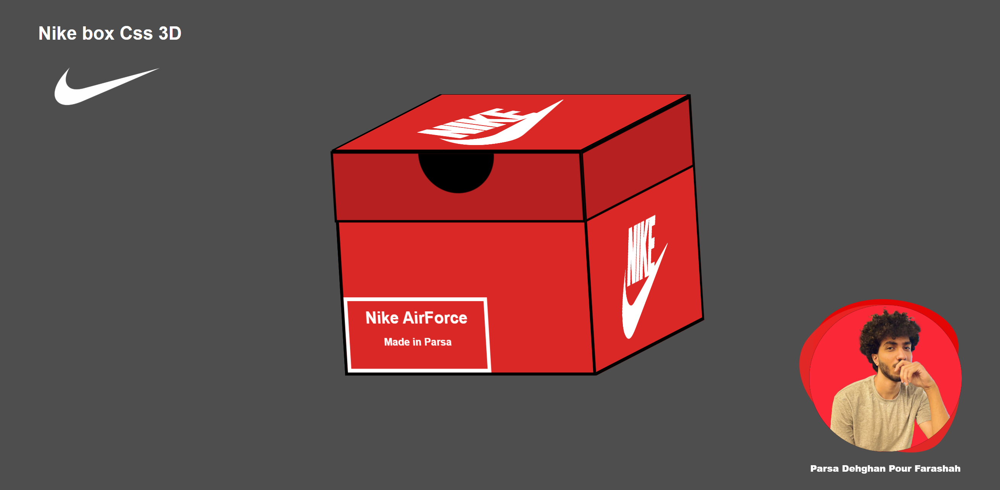

# Frontend Project – NikeBox 3D by Parsa Dehghan Pour Farashah

A simple frontend project developed using HTML and CSS.

---

## ✨ What Is NikeBox?

**NikeBox** is not just a box — it's a slick 3D visual built entirely with pure **HTML & CSS**.  
Hover over it and watch it come to life: the Nike shoebox smoothly rotates in 3D, revealing its modern, minimalistic form.

> No JavaScript. No frameworks. Just clean code and creative vision.  

⚡ Perfect for showcasing interactive UI skills using only frontend magic.

---

## 📅 Created On  
jul 04, 2025

## 👨‍💻 Developed By  
Parsa Dehghan Pour Farashah

## 🛠️ Technologies Used  
- HTML  
- CSS  

## 🎯 Role  
Frontend Developer

## 🔗 [🌐 Live Demo – See It in Action!](https://parsa-farshah.github.io/NikeBox/)

## 📬 How to Reach Me  
- Instagram: [@parsa_dehghanpour_dv](https://www.instagram.com/parsa_dehghanpour_dv?igsh=eHkwNWhsa3I4ZWVp)  
- LinkedIn: [Parsa Dehghan Pour Farashah](https://www.linkedin.com/in/parsa-dehghan-pour-farashah-85ab04250?utm_source=share&utm_campaign=share_via&utm_content=profile&utm_medium=android_app)

---

